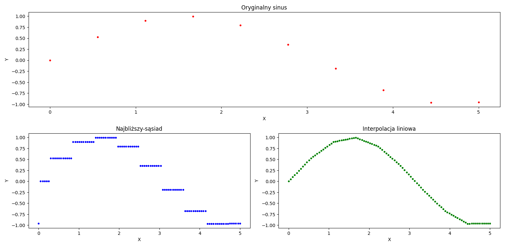
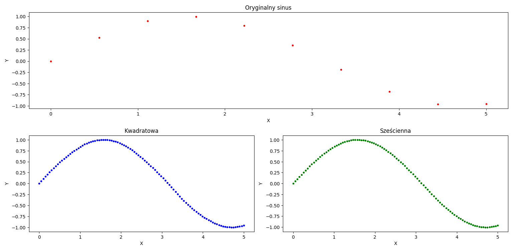
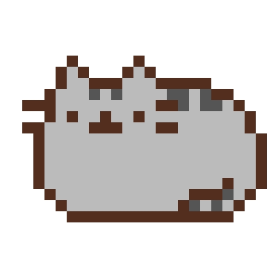
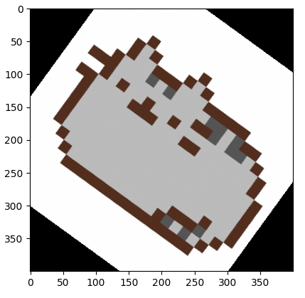

# Sygnaly i obrazy cyfrowe
## Wstęp:
Podany kod został stworzony na zajęciach z _"Przetwarzania sygnałów i obrazów cyfrowych"_. Kurs odbywał się na 3 semestrze kierunku _"Informatyczne systemy automatyki"_ (studia 1 stopnia). Program obejmuje następujące zagadnienia:
1. Interpolacja sygnałów jednowymiarowych - pokazanie na czym polega interpolacja oraz w jaki sposób obliczyć błąd średnio-kwadratowy.
2. Interpolacja sygnałów dwuwymiarowych - zasymulowanie działania filtru Bayera oraz filtru Fuji, przeprowadzenie interpolacji obrazu.
3. Obrót obrazu - obrót obrazu o zadany kąt.

## 1.Intrpolacja sygnałów 1D.
### Opis:
Aby zaprezentować na czym polega interpolacja, stworzyliśmy wykres sinusa składający się z 10 punktów z przedziału [0;5]. Za pomocą interpolacji należało rozszerzyć ten wykres do 100 punktów. W tym celu zaimplementowałem 4 rodzaje interpolacji:
* Najbliższy-sąsiad - najprostsza metoda, powiela wartość najbliższego sąsiada.
* Liniowa - w celu stworzenia nowego punktu liczona jest średnia z 2 sąsiadujących punktów.
* Wielomianowa 2 stopnia - interpolacja za pomocą funkcji kwadratowej. Bierze pod uwagę 3 sąsiadujące punkty.
* Wielomianowa 3 stopnia - interpolacja za pomocą funkcji sześcienną. Bierze pod uwagę 4 sąsiadujące punkty.
### Działanie:

## 2.Interpolacja sygnałów 2D.
### Opis:
Drugie zadanie składało się z 2 podzadań. Na początku musieliśmy przepuścić obraz przez filtry Bgayer'a i Fuji. Działają one w ten sposób, że przepuszczają tylko 1 z 3 kolorów palety RGB. Główną różnicą pomiędzy filtrami jest ułożenie płytek przepuszczających odpowiednie kolory. Następnie za pomocą interpolacji musieliśmy przywrócić obraz do stanu początkowego (Dla każdego piksele uzupełnić jego wartości RGB). 
### Działanie:
Filtr Bayer'a:

Filtr Fuji:

Obraz po zastosowaniu filtru Bayer'a:

Obraz po interpolacji liniowej:

## 3.Obrót obrazu.
### Opis:
Ostatnim zadaniem było stworzenie funkcji obracającej obraz o **dowolny kąt**. Obrót o wielokrotność 90 stopni nie powoduję większych problemów ponieważ piksele po prostu zmieniają miejsce. Przy obrocie o nieregularny kąt np: 36 stopni piksele zmieniają pozycję tak, że trafiają w nieregularne pozycje np: pomiędzy 2 pikselami. Wtedy należy zastosować intrpolację. Obrót o 45 stopni powoduje, że tylko niektóre piksele trafiają w regularne piksele. Trzeba wtedy rozróżnić które piksele trzeba interpolować a które trzeba skopiować.
### Metoda obracania:
Aby obrócić obraz należy zacząć od końca. Dla każdego piksela obróconego obrazu sprawdzamy w jakim miejscu byłby przed odwróceniem. Postępujemy w następujący sposób dla każdego piksela wynikowego obrazu:
1. Przesuwamy go o połowę wysokości i szerokości obrazu w stronę środka układu współrzędnych.
2. Mnożymy przez macierz obrotu.
3. Jeżeli piksel trafia w regularną pozycję to kopiujemy jego wartość i przechodzimy do punktu **5.**
4. Jeżeli piksel nie trafia w regularną pozycję (np: 271,1; 221,5) to stosujemy interpolację (np: liniową).
5. Przesuwamy punkt z powrotem o połowę wysokości i szerokości do poprzedniej pozycji.
### Działanie:

